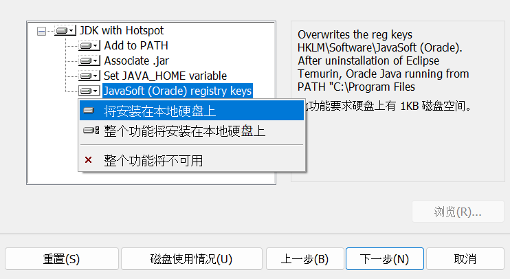
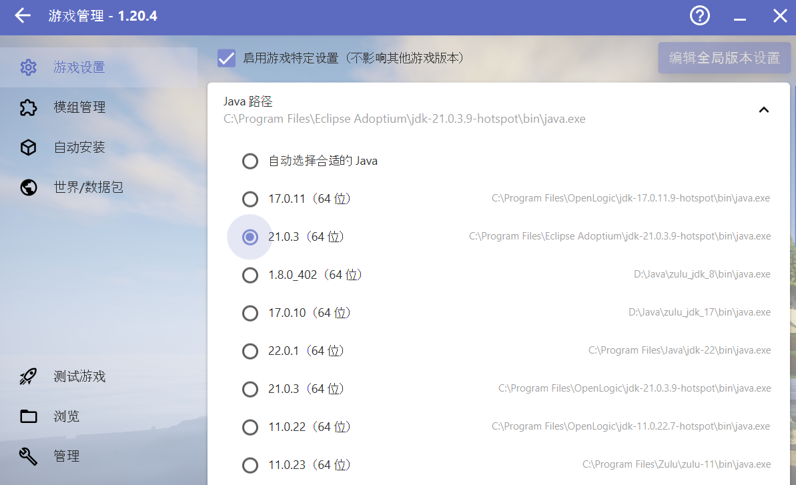
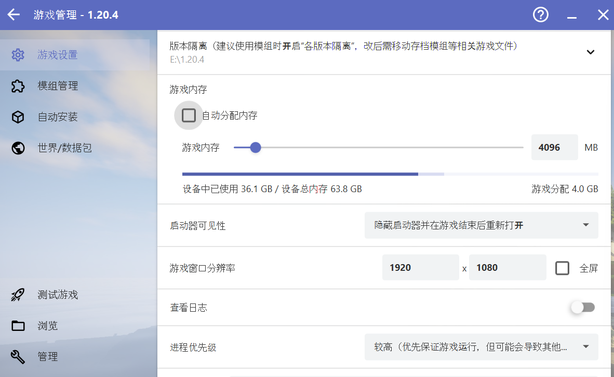

.. include:: preset_color.rst

MC国际版新手安装指南
=================================

转载请遵守 `知识共享署名-相同方式共享 4.0 国际 (CC BY-SA 4.0) 协议 <https://creativecommons.org/licenses/by-sa/4.0/deed.zh-hans>`_

本指南仅针对新手启动国际版作初步指导。

1. 安装 JDK/JRE
-----------------

只有安装JDK/JRE(Java开发工具包或者Java运行时环境)后，基于Java的应用程序才可以运行。
本指南将使用HMCL启动器启动国际版，国际版客户端和HMCL均需安装JDK/JRE后才可运行。
本指南提供adoptium OpenJDK 21下载，点击链接后按照页面提示下载。

→ `从官网下载 <https://adoptium.net/temurin/releases/?os=windows&arch=any&package=jdk>`_

或者→ `前往服务器QQ群文件中下载 <https://qm.qq.com/q/A7Q9OSR310>`_

安装时，不要更改安装路径。

安装步骤至如下界面时，将所有功能选择"将安装在本地硬盘上"，如下图所示。

2. 安装启动器 HMCL
-----------------

每次启动国际版MC都需要它，请将它放在桌面或其它常见位置。

:red:`请在步骤1彻底完成后再进行该步骤！`

→ `从HMCL Jenkins构建站下载 <https://ci.huangyuhui.net/job/HMCL/>`_

或者→ `从Github下载 <https://github.com/HMCL-dev/HMCL/releases/download/v3.5.8.249/HMCL-3.5.8.249.exe>`_

或者→ `前往服务器QQ群文件中下载 <https://qm.qq.com/q/A7Q9OSR310>`_

3. 配置启动器
-----------------

3.1 配置用户名: HMCL主页面-左上角"账户"-"离线模式"(你没有正版或希望用户名与网易游戏名相同以同步数据)/"微软账户"(正版登录)

3.2 下载客户端: HMCL主页面-"版本列表"-添加游戏目录(该目录为存储游戏文件的地方)-添加完成后，在"版本列表"左侧选择你刚刚创建的游戏目录-下载游戏版本-下载1.20.4

3.3 配置客户端Java: HMCL主页面-点击"版本列表"按钮上方的游戏版本，勾选"启用游戏特定设置(不影响其他游戏版本)"-"Java路径"选择21.0.3(本指南上文所用)

3.4 配置客户端内存: 同3.3页面-"游戏内存"-取消勾选自动分配内存-按自身情况自行分配内存，一般为2048~4096MB，分配内存+已使用内存不超过总内存即可

3.5 启动游戏: HMCL主页面-右下角启动游戏