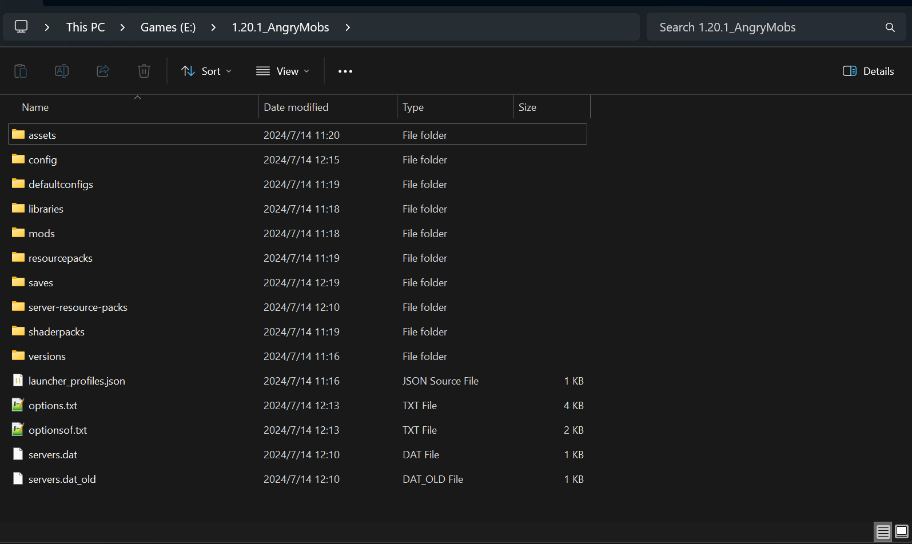

.. include:: preset_color.rst

HMCL导入完整游戏包体新手指南
===========================

转载请遵守 `知识共享署名-相同方式共享 4.0 国际 (CC BY-SA 4.0) 协议 <https://creativecommons.org/licenses/by-sa/4.0/deed.zh-hans>`_

本指南仅对包含完整游戏文件的包体导入作初步指导。
本指南为 非规范形式(一般启动器不支持一键导入)的整合包导入指南。

1. 获得普通文件形式(非压缩包)的游戏完整文件
-------------------------------------

一般情况下，获得非规范形式的整合包文件为.zip/.rar/.7z形式的压缩文件。
请将文件解压缩至一个单独的文件夹。
解压后的文件形式应该如图。

2. 使用HMCL导入游戏文件
------------------

依次打开 HMCL主见面-"版本列表"-左侧列表底部"添加游戏目录"(非"安装新游戏版本“)-至如图所示界面

名称：自行创建，便于后续分辨不同游戏包体即可
游戏路径：点击右侧笔形状按钮，导航至指南第一步中游戏文件夹的上一级文件夹。
如第一步中显示的游戏文件内容路径在E:\1.20.1_AngryMobs下，那么则选择E盘下"1.20.1_AngryMobs"这个文件夹。
最终如图所示。

随后点击右下角"保存"按钮。

3. 配置启动器
------------------

返回至HMCL主界面-点击"版本列表"-在左侧列表选中上一步创建的游戏版本，其显示的名称应为上一步在"名称"一栏填写的名称

返回至HMCL主界面-点击"版本列表"上方的按钮(若随后显示"没有已安装的游戏"，则说明前几步配置有误或游戏包文件缺失/错误)-勾选"启用游戏特定设置(不影响其他游戏版本)"
-展开Java路径，选择合适的Java版本(详细信息和下载链接(仅提供Zulu版本OpenJDK下载链接)如下，安装对应Java完成后需要重启HMCL)。

1.0 - 1.11.x 可以使用 Java 6 和 Java 7，但推荐使用 Java 8。

1.12(17w13a) - 1.16.5(1.17-21w18a) 需要使用 Java 8。

1.17(21w19a) - 1.17.1 需要使用 Java 16。

1.18(1.18-pre2) - 1.20.4(24W13A) 需要使用 Java 17。

1.20.5(24w14a) 及以上版本需要使用 Java 21。

`前往下载Java 8 <https://www.azul.com/downloads/?version=java-8-lts&package=jdk#zulu>`_ || `前往下载Java 17 <https://www.azul.com/downloads/?version=java-17-lts&package=jdk#zulu>`_ || `前往下载Java 21 <https://www.azul.com/downloads/?version=java-21-lts&package=jdk#zulu>`_

:red:`下载列表在页面较下方的位置，不是上方中间的大大的下载按钮。在下方列表选择适合自己系统的版本，一般为Windows x64 版本，下载按钮的下拉框选择.msi版本下载`

`版本参考来源wiki.pha.hub <https://wiki.pha.pub/books/f7184/page/minecraft-java-jrejdk>`_

Java配置完成后，在同一页面下方配置内存，取消勾选"自动分配内存"，滑动滑块手动配置内存。
按自身情况自行分配内存，一般为2048~4096MB，较大型整合包可自行增加内存用量。分配内存+已使用内存不超过总内存即可。

完成后回到HMCL主页面，右下角启动游戏即可。