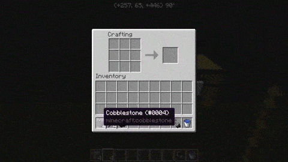
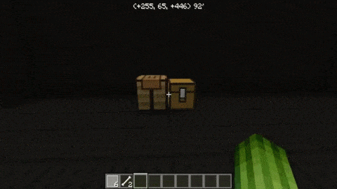
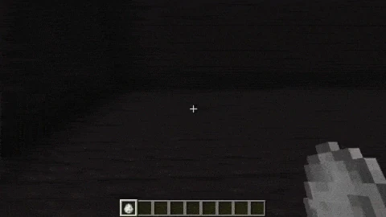

插件使用指南
==============

更多家具 (DiceFurniture)
-----------------------------

本条目遵循 `CC BY-SA 4.0 <https://creativecommons.org/licenses/by-sa/4.0/deed.zh-hans>`_ | `原文链接 <https://smpcraft.fandom.com/wiki/DiceFurniture>`_

* 桶 (Barrels)

.. image:: images/plugins_guide/DiceFurniture/Barrels/recipe.webp
  :width: 400
  :alt: 合成

.. image:: images/plugins_guide/DiceFurniture/Barrels/function.webp
  :width: 400
  :alt: 功能

* 捕熊陷阱 (Bear Trap)

.. image:: images/plugins_guide/DiceFurniture/BearTrap/function.webp
  :width: 400
  :alt: 功能

* 黑板 (Blackboard)

* 摄像机 (Camera)

.. image:: images/plugins_guide/DiceFurniture/Camera/recipe.webp
  :width: 400
  :alt: 合成
.. image:: images/plugins_guide/DiceFurniture/Camera/function.webp
  :width: 400
  :alt: 功能

* 露营板凳 (Camp Chair)

.. image:: images/plugins_guide/DiceFurniture/CampChair/recipe.webp
  :width: 400
  :alt: 合成
.. image:: images/plugins_guide/DiceFurniture/CampChair/function.webp
  :width: 400
  :alt: 功能

* 营火 #1 (Campfire #1)

.. image:: images/plugins_guide/DiceFurniture/Campfire1/recipe.webp
  :width: 400
  :alt: 合成

* 营火 #2 (Campfire #2)

.. image:: images/plugins_guide/DiceFurniture/Campfire2/function1.webp
  :width: 400
  :alt: 功能1
.. image:: images/plugins_guide/DiceFurniture/Campfire2/function2.webp
  :width: 400
  :alt: 功能2

* 弹射器 (Catapult)

.. image:: images/plugins_guide/DiceFurniture/Catapult/function.webp
  :width: 400
  :alt: 功能

* 椅子 (Chair)

.. image:: images/plugins_guide/DiceFurniture/Chair/recipe.webp
  :width: 400
  :alt: 合成
.. image:: images/plugins_guide/DiceFurniture/Chair/function.webp
  :width: 400
  :alt: 功能

* 弩 (Crossbow)

.. image:: images/plugins_guide/DiceFurniture/Crossbow/recipe.webp
  :width: 400
  :alt: 合成

* 栅栏 (Fence)

..  image:: images/plugins_guide/DiceFurniture/Fence/function1.webp
   :width: 400
   :alt: 功能1
..  image:: images/plugins_guide/DiceFurniture/Fence/function2.webp
   :width: 400
   :alt: 功能2

* 旗帜 (Flag)

.. image:: images/plugins_guide/DiceFurniture/Flag/function.webp
  :width: 400
  :alt: 功能

* 花盆 (Flower Pot)

.. image:: images/plugins_guide/DiceFurniture/FlowerPot/recipe.webp
  :width: 400
  :alt: 合成

* 吊床 (Hammock)

.. image:: images/plugins_guide/DiceFurniture/Hammock/recipe.webp
  :width: 400
  :alt: 合成
.. image:: images/plugins_guide/DiceFurniture/Hammock/function.webp
  :width: 400
  :alt: 功能

* 人类骨骼 (Human Skeleton)

.. image:: images/plugins_guide/DiceFurniture/HumanSkeleton/recipe.webp
  :width: 400
  :alt: 合成

* 灯笼 (Lantern)

.. image:: images/plugins_guide/DiceFurniture/Lantern/recipe.webp
  :width: 400
  :alt: 合成

* 大桌子(Large Table)

* 木头展示台 (Log)

..  image:: images/plugins_guide/DiceFurniture/Log/function2.webp
   :width: 400
   :alt: 功能2

* 学校椅子 (School Chair)

* 学校桌子 (School Table)

.. image:: images/plugins_guide/DiceFurniture/SchoolTable/function.webp
  :width: 400
  :alt: 功能

* 沙发 (Sofa)

..  image:: images/plugins_guide/DiceFurniture/Sofa/recipe.webp
   :width: 400
   :alt: 合成

* 路灯 (StreetLamp)

..  image:: images/plugins_guide/DiceFurniture/StreetLamp/function1.webp
   :width: 400
   :alt: 功能1
..  image:: images/plugins_guide/DiceFurniture/StreetLamp/function2.webp
   :width: 400
   :alt: 功能2

* 遮阳伞 (Sunshade)

..  image:: images/plugins_guide/DiceFurniture/Sunshade/recipe.webp
   :width: 400
   :alt: 合成

..  image:: images/plugins_guide/DiceFurniture/Sunshade/function2.webp
   :width: 400
   :alt: 功能2

* 桌子 (Table)

.. image:: images/plugins_guide/DiceFurniture/Table/recipe.webp
  :width: 400
  :alt: 合成
.. image:: images/plugins_guide/DiceFurniture/Table/function.webp
  :width: 400
  :alt: 功能

* 帐篷 #1 (Tent #1)

.. image:: images/plugins_guide/DiceFurniture/Tent1/recipe.webp
  :width: 400
  :alt: 合成

* 帐篷 #2 (Tent #2)

.. image:: images/plugins_guide/DiceFurniture/Tent2/recipe.webp
  :width: 400
  :alt: 合成

* 帐篷 #3 (Tent #3)

.. image:: images/plugins_guide/DiceFurniture/Tent3/function.webp
  :width: 400
  :alt: 功能

* 垃圾桶 (Trashcan)

.. image:: images/plugins_guide/DiceFurniture/Trashcan/recipe.webp
  :width: 400
  :alt: 合成

* 树干 (Trunk)

.. image:: images/plugins_guide/DiceFurniture/Trunk/function.webp
  :width: 400
  :alt: 功能

* 电视 (TV)

.. image:: images/plugins_guide/DiceFurniture/TV/function.webp
  :width: 400
  :alt: 功能

TrainCarts
--------------

本条目遵循 `CC BY-SA 4.0 <https://creativecommons.org/licenses/by-sa/4.0/deed.zh-hans>`_ | `原文链接 <https://wiki.traincarts.net/p/TrainCarts/zh-hans>`_

由Bergerkiller开发的Traincart插件（以下简称TC插件）涵盖了Minecraft中有关矿车的一切内容。
其最初目的是为了将多个矿车编组，使其能像现实中的火车一样运行。
随着时间的推移，该插件逐渐衍生出更多功能，如控制牌、指令、列车属性等。

* 列车
首先，通过TC插件可以将多辆矿车连接在一起，编组为一列无限长度的火车。这列车中的每节车厢在插件中被定义为一个“成员（Member）”，所有成员组成的列车称之为“组（Group）”，每个成员都会和组内的其它成员共享运行状态和信息，所以当第一节矿车撞到障碍物时，组内的所有其它矿车都会停下来。同样，当推动整列火车时，由于外力需要克服整列火车的摩擦力，所以长编组列车的反应速度比短编组慢。

默认情况下，玩家放置的所有矿车都将成为受 TrainCarts插件 管理的矿车。

* 属性
列车和列车的各个车厢都有属性。可以使用命令（/train 和 /cart）或使用 [告示牌符号] 来设置。

* 新的物理特性
列车可以在压力板上方和梯子侧面行驶，也可以在方块下方放置的轨道上倒悬运行。

* 指令
除了以上内容，也有多种指令让玩家可以实时调整整列列车或单节列车的运行属性。

* 列车生成箱
一个特殊的物品能让整列车被当作一个物品捡起或放置。

* 路径查找
列车可以设置一个目的地，之后道岔控制牌会根据目的地自动切换道岔，以最短的路径引导列车驶向目的地。
通过此功能可实现一个大型铁路网的自动化控制，将列车自动发送至不同目的地。还可以配置火车应访问的目的地列表，并使火车自动从一个目的地前往下一个目的地，实现路径点功能。

* 列车票
列车票可用于限制谁可以进入列车。它们还可以用于在使用时为列车分配属性，例如分配要去的目的地。