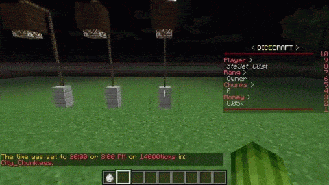

插件使用指南
==============

更多家具 (DiceFurniture)
-----------------------------

本条目遵循 `CC BY-SA 4.0 <https://creativecommons.org/licenses/by-sa/4.0/deed.zh-hans>`_ | `原文链接 <https://smpcraft.fandom.com/wiki/DiceFurniture>`_

* 桶 (Barrels)

.. image:: images/plugins_guide/DiceFurniture/Barrels/function.webp
  :width: 400
  :alt: 功能

* 捕熊陷阱 (Bear Trap)

.. image:: images/plugins_guide/DiceFurniture/BearTrap/recipe.webp
  :width: 400
  :alt: 合成
.. image:: images/plugins_guide/DiceFurniture/BearTrap/function.webp
  :width: 400
  :alt: 功能

* 黑板 (Blackboard)

.. image:: images/plugins_guide/DiceFurniture/Blackboard/recipe.webp
  :width: 400
  :alt: 合成
.. image:: images/plugins_guide/DiceFurniture/Blackboard/function.webp
  :width: 400
  :alt: 功能

* 摄像机 (Camera)

.. image:: images/plugins_guide/DiceFurniture/Camera/recipe.webp
  :width: 400
  :alt: 合成
.. image:: images/plugins_guide/DiceFurniture/Camera/function.webp
  :width: 400
  :alt: 功能

* 露营板凳 (Camp Chair)

.. image:: images/plugins_guide/DiceFurniture/CampChair/function.webp
  :width: 400
  :alt: 功能

* 营火 #1 (Campfire #1)

.. image:: images/plugins_guide/DiceFurniture/Campfire1/recipe.webp
  :width: 400
  :alt: 合成
.. image:: images/plugins_guide/DiceFurniture/Campfire1/function.webp
  :width: 400
  :alt: 功能

* 营火 #2 (Campfire #2)

.. image:: images/plugins_guide/DiceFurniture/Campfire2/recipe.webp
  :width: 400
  :alt: 合成

.. image:: images/plugins_guide/DiceFurniture/Campfire2/function2.webp
  :width: 400
  :alt: 功能2

* 弹射器 (Catapult)

.. image:: images/plugins_guide/DiceFurniture/Catapult/recipe.webp
  :width: 400
  :alt: 合成

* 椅子 (Chair)

* 弩 (Crossbow)

.. image:: images/plugins_guide/DiceFurniture/Crossbow/function.webp
  :width: 400
  :alt: 功能

* 栅栏 (Fence)

..  image:: images/plugins_guide/DiceFurniture/Fence/recipe.webp
   :width: 400
   :alt: 合成

* 旗帜 (Flag)

.. image:: images/plugins_guide/DiceFurniture/Flag/recipe.webp
  :width: 400
  :alt: 合成

* 花盆 (Flower Pot)

.. image:: images/plugins_guide/DiceFurniture/FlowerPot/recipe.webp
  :width: 400
  :alt: 合成
.. image:: images/plugins_guide/DiceFurniture/FlowerPot/function.webp
  :width: 400
  :alt: 功能

* 吊床 (Hammock)

.. image:: images/plugins_guide/DiceFurniture/Hammock/function.webp
  :width: 400
  :alt: 功能

* 人类骨骼 (Human Skeleton)

.. image:: images/plugins_guide/DiceFurniture/HumanSkeleton/recipe.webp
  :width: 400
  :alt: 合成
.. image:: images/plugins_guide/DiceFurniture/HumanSkeleton/function.webp
  :width: 400
  :alt: 功能

* 灯笼 (Lantern)

.. image:: images/plugins_guide/DiceFurniture/Lantern/function.webp
  :width: 400
  :alt: 功能

* 大桌子(Large Table)

..  image:: images/plugins_guide/DiceFurniture/LargeTable/recipe.webp
   :width: 400
   :alt: 合成
..  image:: images/plugins_guide/DiceFurniture/LargeTable/function1.webp
   :width: 400
   :alt: 功能1
..  image:: images/plugins_guide/DiceFurniture/LargeTable/function2.webp
   :width: 400
   :alt: 功能2

* 木头展示台 (Log)

..  image:: images/plugins_guide/DiceFurniture/Log/recipe.webp
   :width: 400
   :alt: 合成
..  image:: images/plugins_guide/DiceFurniture/Log/function1.webp
   :width: 400
   :alt: 功能1
..  image:: images/plugins_guide/DiceFurniture/Log/function2.webp
   :width: 400
   :alt: 功能2

* 学校椅子 (School Chair)

.. image:: images/plugins_guide/DiceFurniture/SchoolChair/recipe.webp
  :width: 400
  :alt: 合成
.. image:: images/plugins_guide/DiceFurniture/SchoolChair/function.webp
  :width: 400
  :alt: 功能

* 学校桌子 (School Table)

.. image:: images/plugins_guide/DiceFurniture/SchoolTable/recipe.webp
  :width: 400
  :alt: 合成

* 沙发 (Sofa)

..  image:: images/plugins_guide/DiceFurniture/Sofa/function1.webp
   :width: 400
   :alt: 功能1
..  image:: images/plugins_guide/DiceFurniture/Sofa/function2.webp
   :width: 400
   :alt: 功能2

* 路灯 (StreetLamp)

..  image:: images/plugins_guide/DiceFurniture/StreetLamp/recipe.webp
   :width: 400
   :alt: 合成
..  image:: images/plugins_guide/DiceFurniture/StreetLamp/function1.webp
   :width: 400
   :alt: 功能1

* 遮阳伞 (Sunshade)

..  image:: images/plugins_guide/DiceFurniture/Sunshade/function1.webp
   :width: 400
   :alt: 功能1

* 桌子 (Table)

.. image:: images/plugins_guide/DiceFurniture/Table/function.webp
  :width: 400
  :alt: 功能

* 帐篷 #1 (Tent #1)

.. image:: images/plugins_guide/DiceFurniture/Tent1/function.webp
  :width: 400
  :alt: 功能

* 帐篷 #2 (Tent #2)

.. image:: images/plugins_guide/DiceFurniture/Tent2/recipe.webp
  :width: 400
  :alt: 合成
.. image:: images/plugins_guide/DiceFurniture/Tent2/function.webp
  :width: 400
  :alt: 功能

* 帐篷 #3 (Tent #3)

.. image:: images/plugins_guide/DiceFurniture/Tent3/recipe.webp
  :width: 400
  :alt: 合成

* 垃圾桶 (Trashcan)

.. image:: images/plugins_guide/DiceFurniture/Trashcan/function.webp
  :width: 400
  :alt: 功能

* 树干 (Trunk)

.. image:: images/plugins_guide/DiceFurniture/Trunk/recipe.webp
  :width: 400
  :alt: 合成

* 电视 (TV)

.. image:: images/plugins_guide/DiceFurniture/TV/recipe.webp
  :width: 400
  :alt: 合成
.. image:: images/plugins_guide/DiceFurniture/TV/function.webp
  :width: 400
  :alt: 功能

动力列车 (TrainCarts) - 总览
--------------

本条目遵循 `CC BY-SA 4.0 <https://creativecommons.org/licenses/by-sa/4.0/deed.zh-hans>`_ | `原文链接 <https://wiki.traincarts.net/p/TrainCarts/zh-hans>`_

由Bergerkiller开发的Traincart插件（以下简称TC插件）涵盖了Minecraft中有关矿车的一切内容。
其最初目的是为了将多个矿车编组，使其能像现实中的火车一样运行。
随着时间的推移，该插件逐渐衍生出更多功能，如控制牌、指令、列车属性等。

* 列车
首先，通过TC插件可以将多辆矿车连接在一起，编组为一列无限长度的火车。这列车中的每节车厢在插件中被定义为一个“成员（Member）”，所有成员组成的列车称之为“组（Group）”，每个成员都会和组内的其它成员共享运行状态和信息，所以当第一节矿车撞到障碍物时，组内的所有其它矿车都会停下来。同样，当推动整列火车时，由于外力需要克服整列火车的摩擦力，所以长编组列车的反应速度比短编组慢。

默认情况下，玩家放置的所有矿车都将成为受 TrainCarts插件 管理的矿车。

* 属性
列车和列车的各个车厢都有属性。可以使用命令（/train 和 /cart）或使用 [告示牌符号] 来设置。

* 新的物理特性
列车可以在压力板上方和梯子侧面行驶，也可以在方块下方放置的轨道上倒悬运行。
`物理特性 <#动力列车-物理特性>`_

* 指令
除了以上内容，也有多种指令让玩家可以实时调整整列列车或单节列车的运行属性。

* 列车生成箱
一个特殊的物品能让整列车被当作一个物品捡起或放置。

* 路径查找
列车可以设置一个目的地，之后道岔控制牌会根据目的地自动切换道岔，以最短的路径引导列车驶向目的地。
通过此功能可实现一个大型铁路网的自动化控制，将列车自动发送至不同目的地。还可以配置火车应访问的目的地列表，并使火车自动从一个目的地前往下一个目的地，实现路径点功能。

* 列车票
列车票可用于限制谁可以进入列车。它们还可以用于在使用时为列车分配属性，例如分配要去的目的地。

动力列车 (TrainCarts) - 物理特性
--------------

* 简介
TC插件同样提供了一些新的物理特性：矿车可以在梯子和压力板上运行。插件会将上述两个方块视作为轨道。

* X-crossing（X型交叉口）
压力板充当简单的 X 形交叉，让两侧继续到另一侧。如果一侧未连接到另一侧导轨，它将充当简单的单向导轨。可以使用木制和石制压力板。

* 垂直导轨
梯子可以用作垂直轨道。火车会很好地在它们旁边滑行，并毫无问题地离开它们。要使火车脱离垂直轨道，请放置一条倾斜的轨道连接到它。
此连接由插件自动处理。为了在不失去动量的情况下从水平变为垂直，请在两条轨道之间放置一条倾斜的轨道。
车站也可以垂直工作，然后您可以在标志上方或下方通电以更改方向，或使用上下方向。

动力列车 (TrainCarts) - 控制牌
--------------------------------

* 结构和行为
标志的结构总是相同的。第一行包含推车或火车，具体取决于您是要单独定位每个推车还是将火车作为一个整体。
然后，您可以选择指定标志对红石的响应方式以及火车必须从哪个方向驶来。

* 红石
TrainCarts标志需要Redstone电源才能运行。这意味着除非您在标志旁边放置红石火炬或其他电源信号，
否则标志不会做任何事情。如果要在不添加红石火炬的情况下使用标志，则可以在第一行使用特殊语法，
该语法与[火车]和[购物车]相同。通常，您需要使用 [+train] 来制作符号函数。

TrainCarts 标志电源模式
一线         解释
[火车]	    默认模式。标志仅在提供红石电源时才有效
[+火车]	    始终开启电源模式。无论是否提供红石电源，标志都一直在工作
[！火车]	    反相电源模式。标志一直工作，并在提供红石电源时关闭。在不使用红石火炬时与[+train]相同。
[-火车]	    始终关闭电源模式。星座对红石的力量没有反应。仅对切换器标志有用。
[/火车]	    脉冲电源模式。当红石电源从关闭到打开时，标志只会激活一次，并且不会对驶过它的火车做出反应
[\\火车]	    非脉冲电源模式。当红石电源从打开到关闭时，标志才会激活一次，并且不会对经过它的火车做出反应
[\/\\火车]	Redstone 更改电源模式。标志仅在红石电源切换状态时激活一次，并且不会对驶过它的火车做出反应

* 杠杆输出
标志也可以通过将杠杆连接到标志所附的同一块上来输出红石信号。只有少数标志会激活杠杆，
例如当火车停在车站顶部时激活它的车站标志。

* 激活方向
默认情况下，只有当火车看到标志的正面或侧面时，标志才会激活。这意味着您应该将标志面向火车运动的方向放置。
若要覆盖此行为，可以通过添加冒号 （:) 后跟一个或多个方向来设置这些激活方向。如果您希望标志始终响应，
只需使用 [train：*]。
例如，当列车从相对标志的左侧或右侧进入时，切换器标志上的 [-train：lr] 会激活杠杆，而其余方向则不会。
它使用 -train，因此它不会切换轨道。

* 遥控
一些标志系统支持远程控制：按名称控制列车的能力。然后，使用 [train <name>] 格式或较短的别名 [t <name>]。
遥控标志只对红石变化做出反应，因此放置它们的位置并不重要。到目前为止，属性、目的地、销毁、
弹出和设置块标志系统都支持远程控制。
远程控制也会影响多列火车。就像标签系统一样，遥控器使用 * 标志来识别要影响的列车。
例如，以下遥控标志会将所有城际列车的目的地设置为回家：
[train Intercity*]
property
destination
interhome
您可以使用它轻松调用所有火车。如果您使用标签来导航火车，您还可以添加一个标签，说明火车应该返回。

* 放置
每个标志都针对上面的某个曲目。贴在墙上的标志会拿起它们所附着的街区，抬头看，直到找到一条轨道。
然后，该轨道用于该标志。路标抬头看，直到找到一条轨道。底部标志和轨道之间可能没有没有标志的街区。
您可以在单个轨道部件下方制作一根方块柱，并在其上附加标志，以在单个轨道部件上制作一系列动作。
当火车进入新的轨道时，它们会向下看以检查标志，因此请确保将输出标志放在使用此输出的标志上方以获得正确的结果。
一个明显的例外是 TrainCart 插件的附加组件，它可能会改变标志需要放置的（相对）位置才能在轨道上工作。
例如，TC Hang Rail 附加组件是否要求您在 Hang Rail 轨道上方添加标志才能工作，
而 TCC（TrainCarts Coasters）附加组件使用节点块作为标志，该节点可以移动到任何其他块。
对于大多数标志，标志方向会影响发生的事情，如前所述（激活方向）
· 火车必须面对标志上的文字才能使标志做出反应
·与轨道对齐方式相同的标志（面向或远离轨道）始终响应
·火车在标志朝向的方向生成

动力列车 (TrainCarts) - 指令
--------------------------------

* 介绍
命令用于通过聊天命令控制火车或单车。它们还可用于执行日常任务，例如从世界中移除所有火车。

* 语法基础
要执行命令，请使用 /train 或 /cart 。使用列车版本时，您希望在整个列车上进行操作或执行全局列车命令。
使用购物车版本时，您希望在单个购物车上进行操作。

* 选择
针对特定火车（/train）或手推车（/cart）的命令要求玩家首先选择火车或手推车。
这可以通过以下方式完成：
·进入购物车
·偷偷摸摸地损坏购物车，这样它就不会坏了（创意）
·用火车生成宝箱生成新火车
·查看购物车，并运行命令/train edit
·列出列车名称并单击列车名称，或在命令中指定列车名称/train list/train edit [name]

* 定位标志
您无需先选择要修改的推车，而是可以使用以下任一标志直接定位列车。这些也适用于命令块。

--train <名称>
/火车最大速度 0.0 --火车 火车12/火车 最大速度 --火车 @train[名称=城际*]
按名称选择列车。支持用@train选择器代替名称，您可以使用它一次定位多个列车。

--最近
/train maxspeed 0.0 --最近
选择离发件人最近的列车。最多128个街区。

--near <x> <y> <z> <distance>
/火车最大速度 0.0 --接近 ~ ~ ~ 5
选择靠近指定坐标的最近列车，距离最远

--cart <索引或entity_uuid>
/cart destroy --nearest --cart 0
从前面选择一个购物车。索引 0 是前方，前方 1 秒，依此类推。“头”和“尾”这两个词也可用于选择第一个或最后一个购物车。可以用其他标志选择要选择推车的火车，否则使用玩家当前正在编辑的火车。

--world <世界名称>
/火车摧毁 --世界 world_nether --靠近 2 66 -134 1.5
默认情况下，标志仅针对发件人所在的世界。有了这个，可以指定一个不同的世界。从服务器终端运行命令时是必需的。

* 全局命令
以下命令仅适用于 /train，不需要选择即可运行。

* 列表
/train list
/cart list
列出世界上固定和移动的火车数量。它还列出了推车实体的总数（作为这些列车的一部分），并列出了属于您的列车。

* 改道
/train reroute [--lazy]
如果路径查找系统因轨迹更改而失败，您可以使用此命令强制插件重新计算所有目标路径。
'--lazy' -参数：
通常，该命令会获取所有已知存在的先前节点，并安排它们进行路由。
使用“--lazy”参数时，一旦购物车驶向切换器标志，并且仅从该节点开始，就会发生这种情况。

* 全部销毁
/train destroyall
/train removeall

* 修复错误
/train fixbugged
销毁所有不受插件管理的矿车。有用的是服务器意外关闭，在轨道上留下了孤立的火车。

* 训练 - 仅命令
以下命令仅适用于 /train。

* 重命名
/train setname [name]
/train name [name]
/train rename [name]
设置列车名称，该名称可能尚未分配给另一列列车

* 设置显示名称
/train setdname [name]
/train displayname [name]
/train setdisplayname [name]
设置列车的显示名称，可以进行双重分配。使用触发器标志时，此名称显示在 SignLink 变量标志上。

* “训练”和“购物车”命令
以下命令适用于 /train 和 /cart。

*信息
/train info
/train i
显示火车或购物车相关信息，例如名称和设置属性。

* 所有权
/train claim

* 将您设置为此列车的唯一所有者。

/train setowner [names...]
/train setowners [names...]
/train setowners

* 设置此列车的所有者名称。不使用任何名称来清除所有者。

/train addowner [names...]
/train addowners [names...]
将所有者名称添加到此列车。

要更改单个矿车的所有权，请使用“/cart”命令而不是“/train”。设置火车车主时，您可以同时在所有矿车上设置车主。如果没有为矿车设置所有者，则可以由其他人自由编辑和销毁。

* 标签
/train settags [tags...]
/train settag [tags...]
/train tags [tags...]
/train tag [tags...]
/train settags
设置此列车的标签。不使用任何标签来清除标签。

/train addtags [tags...]
/train addtag [tags...]
向这列火车添加标签。

标签可以与切换器或检测器标志结合使用。例如，您可以设置一个标签来命令销毁一列火车。每个矿车都有一组单独的标签，在火车上设置标签会同时为所有矿车设置标签。

* 目的地
/train destination [destination]
/train dest [destination]
设置此列车的目的地。

您还可以在火车上的单个矿车上设置目的地，这样就可以让切换器标志将火车分成多个车厢。

* 玩家输入
/train playerenter [bool]
设置玩家是否可以进入火车或矿车。

* 玩家退出
/train playerexit [bool]
/train playerleave [bool]
设置玩家是否可以离开火车或矿车。

* 接
/train pickup [bool]
设置存储矿车（在火车上）是否从地面捡起附近的物品。

* 碰撞
/train collision mobs enter
/train collision player push
/train collision train cancel
/train collision block cancel
设置冲突规则。这可以用来让小怪在与火车相撞时进入火车，禁用火车连接或在玩家挡路时将玩家推到一边。
将与方块的碰撞设置为取消将使列车不再检查与方块的碰撞，这有助于提高性能。

